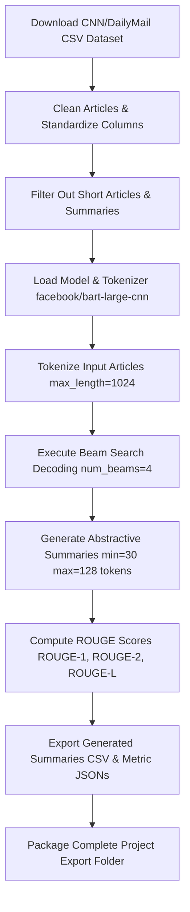

````carousel
# 📝 Abstractive Text Summarization using BART & Encoder-Decoder Models
## Presentation Overview

Welcome! This presentation breaks down the Abstractive Text Summarization project step-by-step using BART and Sequence-to-Sequence models.

**Here's what we will cover:**
1. **The Dataset**: CNN/DailyMail News Summarization dataset.
2. **Tools Used**: PyTorch, Hugging Face Transformers, and ROUGE evaluation.
3. **Project Phases & Flow**: Visualizing the text summarization pipeline.
4. **Code & Parameters**: Explaining data cleaning, token truncation, and Beam Search decoding.
5. **Model Architecture**: Pre-trained `facebook/bart-large-cnn` sequence-to-sequence model.
6. **Outputs & Evaluation**: ROUGE-1/2/L metrics, generated summaries, and exported metadata.
7. **Web App Conversion**: A step-by-step guide to turning this into a live interactive news summarizer web application!

---
> [!NOTE]
> Swipe/click to the next slide to continue!

<!-- slide -->
# 📊 The Dataset
## CNN / DailyMail News Summarization Dataset

**Source & Nature:**
- Kaggle Dataset: `gowrishankarp/newspaper-text-summarization-cnn-dailymail` (or `thedevastator/cnn-dailymail-summarization-dataset`).
- Benchmark dataset containing **~310,000 news articles** paired with human-written summary highlights.

**Data Scale & Splits:**
- **Training Set**: 287,112 articles (`train_df`).
- **Validation Set**: 13,368 articles (`val_df`).
- **Testing Set**: 11,490 articles (`test_df`).

**Field Mapping:**
- **`article`**: Raw full news article text (truncated to 1,024 input tokens).
- **`summary`**: Human reference gold highlights used for ROUGE score benchmarking.

<!-- slide -->
# 🛠️ Tools & Libraries Used

This project leverages state-of-the-art Natural Language Generation (NLG) frameworks:

- **Python**: Core programming language.
- **PyTorch (`torch`)**: Tensor operations, CUDA GPU acceleration, and model evaluation (`model.eval()`).
- **Hugging Face `transformers`**:
  - `AutoModelForSeq2SeqLM` (Sequence-to-sequence encoder-decoder architecture)
  - `AutoTokenizer` (BART Byte-Pair Encoding tokenizer)
  - Primary Model: `facebook/bart-large-cnn` (~406 million parameters)
  - Alternative Models Supported: `sshleifer/distilbart-cnn-12-6`, `google/pegasus-cnn_dailymail`, `t5-small`
- **Hugging Face `evaluate` & `rouge_score`**: ROUGE-1, ROUGE-2, ROUGE-L, and ROUGE-Lsum text generation evaluation metrics.
- **Pandas, NumPy & tqdm**: Dataframe batching, progress tracking, and CSV export.

<!-- slide -->
# 🔄 Project Phases & Flow Diagram

Here is the end-to-end architecture of our Abstractive Text Summarization pipeline:



<!-- slide -->
# 🧹 Step 1: Data Cleaning & Preprocessing

Raw CSV datasets are sanitized and filtered using `prepare_dataframe()`:

```python
# Clean whitespace and newlines
def clean_text(text):
    return re.sub(r"\s+", " ", str(text)).strip()

# Quality Filtering Constraints
df = df[df["article"].str.len() > 100]
df = df[df["summary"].str.len() > 10]
```

**Token Control Parameters:**
- **`MAX_INPUT_TOKENS = 1024`**: Truncates long news articles to BART's maximum context length.
- **`MAX_SUMMARY_TOKENS = 128`**: Caps generated summary length for concise executive summaries.
- **`MIN_SUMMARY_TOKENS = 30`**: Prevents overly brief or single-word generation.

<!-- slide -->
# 🔢 Step 2: BART Sequence-to-Sequence Architecture

The model utilizes **`facebook/bart-large-cnn`**, a bidirectional encoder and autoregressive decoder fine-tuned on news text:

```python
tokenizer = AutoTokenizer.from_pretrained("facebook/bart-large-cnn")
model = AutoModelForSeq2SeqLM.from_pretrained("facebook/bart-large-cnn").to(device)
model.eval()
```

**Generation Strategy (`generate_summaries`):**
```python
summary_ids = model.generate(
    **inputs,
    max_length=128,
    min_length=30,
    num_beams=4,
    length_penalty=2.0,
    no_repeat_ngram_size=3,
    early_stopping=True
)
```
- **`num_beams=4`**: Explores 4 top candidate paths during decoding.
- **`length_penalty=2.0`**: Penalizes prematurely short sequences to encourage complete sentences.
- **`no_repeat_ngram_size=3`**: Prevents repetitive phrases in generated output.

<!-- slide -->
# 🤖 Step 3: ROUGE Evaluation & Metric Results

Summaries were evaluated using **ROUGE (Recall-Oriented Understudy for Gisting Evaluation)**:

```python
rouge = evaluate.load("rouge")
rouge_scores = rouge.compute(predictions=predictions, references=references, use_stemmer=True)
```

**Benchmark Scores Achieved:**
- **ROUGE-1**: **44.64%** (Unigram overlap matching key concepts).
- **ROUGE-2**: **21.12%** (Bigram overlap matching word pair fluency).
- **ROUGE-L**: **30.65%** (Longest Common Subsequence sentence structure).
- **ROUGE-Lsum**: **30.72%** (Summary-level longest common subsequence).

> [!TIP]
> ROUGE-1 score of 44.64% demonstrates high factual and topical fidelity relative to human gold highlights.

<!-- slide -->
# 📈 Outputs & Results

**Artifacts & Reports Generated in Export:**
1. **Generated Summaries CSV**: [generated_summaries.csv](file:///c:/Users/hp/Desktop/city/The_press/text_summarization_project_export/outputs/generated_summaries.csv) comparing original news text, human highlights, and BART-generated summaries.
2. **ROUGE Metric JSON**: [rouge_scores.json](file:///c:/Users/hp/Desktop/city/The_press/text_summarization_project_export/outputs/rouge_scores.json).
3. **Project Metadata**: [project_metadata.json](file:///c:/Users/hp/Desktop/city/The_press/text_summarization_project_export/metadata/project_metadata.json) recording dataset shapes, hardware device, and generation hyperparameters.
4. **Cleaned Dataset Samples**: [test_df_sample_1000.csv](file:///c:/Users/hp/Desktop/city/The_press/text_summarization_project_export/outputs/test_df_sample_1000.csv).
5. **Code Snapshot**: [notebook_code_snapshot.py](file:///c:/Users/hp/Desktop/city/The_press/text_summarization_project_export/code/notebook_code_snapshot.py).

<!-- slide -->
# 🌐 How to turn this into a Web App (Step-by-Step)

To deploy this abstractive text summarizer into a live production web application:

### Step 1: Model Pipeline Integration
Load the pre-trained BART model directly from Hugging Face:
```python
from transformers import AutoTokenizer, AutoModelForSeq2SeqLM
tokenizer = AutoTokenizer.from_pretrained("facebook/bart-large-cnn")
model = AutoModelForSeq2SeqLM.from_pretrained("facebook/bart-large-cnn")
```

### Step 2: Build a Backend API (`app.py` with FastAPI)
- Define a `/summarize` POST endpoint taking JSON: `{"article": "Long news article text..."}`.
- Execute `generate_summaries()` with user-selected length constraints.
- Return structured JSON response:
  ```json
  {
    "original_word_count": 850,
    "summary_word_count": 65,
    "reduction_percentage": "92.3%",
    "summary": "Generated executive summary text..."
  }
  ```

### Step 3: Interactive News Summarizer Web Dashboard
- Build a user interface featuring a side-by-side view (Original Long Article vs. AI Executive Summary).
- Include an interactive summary length slider (`Short (30 words)` vs `Medium (60 words)` vs `Detailed (128 words)`).
- Display a **Reading Time Saved** badge (e.g., *"Saved 4 minutes of reading time!"*) with a one-click copy button.

### Step 4: Deploy
- Deploy the Python API backend to Render / Railway / AWS.
- Deploy the Web interface to Vercel / Netlify.
````
